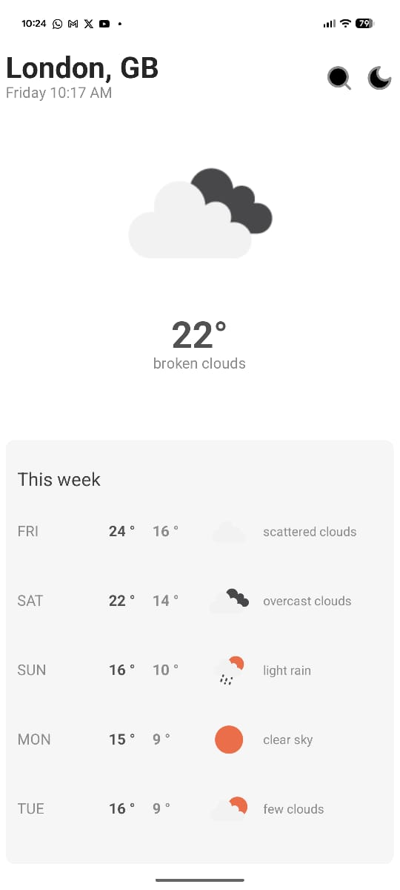

<div align="center">

# Weatha — Simple Weather App

A minimal weather app built with Expo that requests your location, fetches the current conditions and a weekly forecast, and persists the last fetched data for quick startup. Supports light/dark mode.

</div>

---

## Features

- **Current weather**: based on your location
- **Weekly forecast**: 5‑day outlook
- **Permission-aware**: manual city entry if location is denied
- **Smart caching**: React Query staleness and background refetch
- **Persistence**: Zustand + AsyncStorage stores last weather and settings
- **Theming**: light/dark toggle, system-aware
- **UI/Platform**: GlueStack UI v3, Expo SDK 54

## Screenshots

<p align="center">
  
  
  
</p>

## Tech Stack

- Expo SDK 54 (React Native 0.81, React 19)
- Expo Router
- GlueStack UI v3
- @tanstack/react-query v5
- Zustand + @react-native-async-storage/async-storage
- Expo Location
- Axios

## How it works

- On launch, the app requests foreground location permission with `expo-location`.
- If granted, it fetches current weather and forecast from OpenWeather using your coordinates.
- If denied/unavailable, it shows a city search screen to set coordinates.
- React Query manages fetching, caching and staleness:
  - Current weather staleTime: 5 minutes
  - Forecast staleTime: 30 minutes
- Last successful data is persisted, so you see previous results immediately on reopen while freshness checks run.
- Theme can follow system or be toggled to light/dark.

## OpenWeather API Key

- For local dev, create a `.env` file in the project root with:

```env
EXPO_PUBLIC_OPENWEATHER_API_KEY=your_openweather_api_key
```

- For released APK/IPA builds, the key is bundled so end users don’t need to set it up.

> Note: Bundling keys in client apps is fine for demos but not ideal for sensitive/paid keys.

## Getting Started

1. Install dependencies

```bash
npm install
```

2. Add your `.env`

```bash
# .env
EXPO_PUBLIC_OPENWEATHER_API_KEY=your_openweather_api_key
```

3. Run the app

```bash
npx expo start
# or
npm run android
npm run ios
```

## Project Structure (high-level)

```
app/                # Expo Router screens
components/         # UI and shared components
context/            # Theme provider
hooks/              # useWeather, useLocation
services/           # API calls (OpenWeather)
store/              # Zustand store (persisted)
utils/              # Mapping/formatting helpers
assets/images/      # App images (weatha-*.jpg)
```

## Key Implementation Details

- Data fetching: `@tanstack/react-query` with alert-based error handling
- Stale times: current (5 min), forecast (30 min)
- Persistence: Zustand + AsyncStorage (`weather-ui` storage key)
- Location: `expo-location` for permissions and coordinates
- UI: `@gluestack-ui/core` with theme mode from context

## Assets

Extra Weatha images live in `assets/images` and start with the `weatha` prefix.

## Credits

- Weather data by [OpenWeather](https://openweathermap.org)
- Built with [Expo](https://expo.dev) and [GlueStack UI](https://gluestack.io)

---

Happy hacking!
